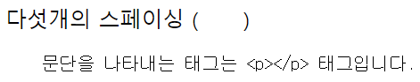

# 기초\_1. 텍스트 요소(20220702)

문서 유형: HTML
작성일시: 2022년 7월 2일 오후 6:48
최종 편집일시: 2022년 7월 11일 오후 7:45

## 0. VScode 단축키 + HTML 요소들

## 1. 제목 - h1 ~ h6

- 글씨 크기를 위해 제목 태그를 사용하지 말것
  → 대신 CSS의 font-size 속성 사용
- 제목 단계 건너뛰지 않기
  → 언제나 <h1>으로 시작해서, <h2>, 순차적으로 기입
- 하나의 페이지에 하나의 <h1>만 사용하기
  → 여러 개를 써도 오류는 나지 않지만, <h1>은 가장 중요한 제목이므로 전체 페이지의 목적을 드러내고 있음
  → 두 개의 제목을 가진 책 같은 느낌
  [- : HTML 구획 제목 요소 - HTML: Hypertext Markup Language | MDN](https://developer.mozilla.org/ko/docs/Web/HTML/Element/Heading_Elements)

## 2. 본문 - p

- 여러 개의 공백(’ ‘)을 주어도 한 개의 공백(’ ’)만 적용됨
- 빈 
 요소를 사용하여 문단 사이에 여백을 주지 말것
  → CSS로 여백 주기(margin)

## 3. 본문 - br

- 문단 사이에 여백을 두기 위한 용도로  을 사용하면 안됨
  → 대신 
 요소로 감싼 후, CSS의 margin 속성으로 여백 크기 조절하기

## 4. 본문 - blockquote, q

- <blockquote>: 인용 **블록** 요소, 안쪽의 텍스트가 긴 인용문
    - 일반 문단과는 달리 여백이 존재 → 이를 통해 일반 문단과 구분함
    - 
 태그 사이에 사용하면 안됨
        
        → 
 태그 내부에 블록 속성의 자식 태그가 존재하면 자동으로 <blockquote> 앞에서 
 태그를 닫아버림
        
    
    
    
    예시

- <q>: **인라인** 인용문 요소, 둘러싼 텍스트가 짧은 인라인 인용문
  - 기본 스타일링으로 앞뒤로 “” 가 붙음
    
- cite: <blockquote>, <q> 공통 속성. 인용문의 출처 문서나 메시지를 가리키는 URL. 인용문의 맥락 혹은 출처 정보를 가리키는 용도로 사용됨

## 5. 본문 - pre

- <pre> 요소는 미리 서식을 지정한 텍스트를 나타내며, HTML에 작성한 내용 그대로 표현
    
    → 지정된 형식이 있어 특별한 가공 없이 그대로 output으로 출력하고 싶을 때 사용

- 고정폭 글꼴을 갖고 있음

  - <pre> 태그와 
 태그에 동일한 텍스트를 넣어도 output이 다르게 나옴
      
      
      
      코드

  
  출력

## 6. 본문 - figure, figcaption

- <figure> 요소는 독립적인 콘텐츠를 표현한다. <figcaption> 요소를 통해 설명(ex. 출처)을 붙일 수 있다.
- 이미지, <pre> 태그, <blockquote> 태그, 
 태그 모두 내부 content로(?) 사용 가능

## 7. 본문 - hr

- 
 요소는 이야기 장면 전환, 구획 내 주제 변경 등, 문단 레벨 요소에서 주제의 분리를 나타낸다. == 수평선
- HTML 속성 말고 CSS로 스타일링하는 것을 권장함

## 8. 본문 - abbr, address, cite, bdo

- <abbr>: 약어(abbreviation). 이니셜을 적고, title 속성을 사용하여 약어의 원래 의미를 작성한다.
  
  코드
  
  출력
- <address>: 주소(이메일 주소, 연락처 정보 등등)를 통칭하여 나타낼 때 사용한다.
    - 별도의 기능을 한다기보다, 내부 content가 주소라는 것을 나타낸다는 의미가 크다.
    - 내부 content의 텍스트가 기울어져 있는 것이 특징
        
        
        
        코드
        
        
        
        출력

- <cite>: 인용한다는 의미를 가진다. 인용한 사이트의 출처를 나타낼 때 <cite> 태그로 묶어서 사용한다.
  - 내부 content의 텍스트가 기울어져 있는 것이 특징
  - <blockquote> 태그의 속성으로도 사용할 수 있지만, 이러한 경우에는 cite 속성값이 출력되지는 않는다.
    
    코드
    
    출력
- <bdo>: bidirectional override의 약자. 텍스트를 반대 방향으로 출력하고 싶을 때 사용한다.
  - dir 속성에 값 넣어주기, rtl == right to left. ltr(== left to right) 값을 넣어주면 원래 방향으로 돌아옴(default 값)
    
    코드
    
    출력

## 9. 포매팅 - b, strong

- <b>: bold. 독자의 주의를 끌기 위한 용도로 사용한다. 그 외의 다른 **특별한 중요도는 주어지지 않는다**.
  → <b> 태그로 전체 텍스트를 굵게 만드는 등, 텍스트를 꾸미는 용도로 사용하면 안됨. CSS의 font-weight를 사용하거나, <strong> 요소를 사용하여 특별히 중요한 텍스트를 나타내길 권장
- <strong>: **중대하거나 긴급한 컨텐츠**

→ 둘의 차이가 미묘하다고 느껴질 수도 있으나, 스크린 리더(?)를 사용할 때 차이가 존재한다. <b> 태그의 경우, 여느 문장과 다른 점이 없지만, <strong> 태그의 경우, 해당 문장을 더욱 강조하여 읽는다고 함.

## 10. 포매팅 - i, em

- <i>: 텍스트에서 어떤 이유로 주위와 구분해야 하는 부분을 나타낸다. 기술 용어, 외국어 구절, 등장인물의 생각 등을 나타낼 때 사용한다. 보통 기울임꼴로 표시한다.
- <em>: 텍스트의 강세를 나타낸다. <em> 태그를 중첩하면 더 큰 강세를 뜻하게 된다.

→ <b>, <strong> 태그간의 차이와 동일. <i> 태그와 달리 <em> 태그의 경우 스크린 리더를 사용할 때 아나운서가 강조해서 읽는다.

코드

출력

→ 이를 통해 Iron Man이 ‘철남자’ 가 아닌 고유 명사로서 유저가 받아들이기 쉬워진다.

## 11. 포매팅 - mark, small, sub, sup

- <mark>: 하이라이팅해주는 태그. 관심 부분 강조, 상황에 맞는 구절을 식별할 때에 사용한다. 스크린 리더에서 인지하지 못한다.
  
  
- <small>: 덧붙임 글 요소. 덧붙이는 글이나, 저작권과 법률 표기 등의 작은 텍스트를 나타낼 때 사용한다.
  
  
- : 아래 첨자 요소. 화학식, 각주 표기, 변수 표기할 때 사용한다.
  
  
- : 위 첨자 요소. 지수 표기, 서수 표기할 때 사용한다.
  
  

## 12. 포매팅 - del, ins, code, kbd

- **[**<del>: 문서에서 제거된 텍스트의 범위를 나타낸다.
- <ins>: 문서에 추가된 텍스트의 범위를 나타낸다.**]** → **세트처럼 쓰이기도 함**
  - cite: 변경점에 대해 기술할 때 사용한다.
  - datetime: 변경이 발생한 일시에 대해 기술할 때 사용한다.
    
    코드
    
    출력
- <code>: 짧은 코드 조각을 나타내는 스타일을 사용하여 자신의 콘텐츠를 표시할 때 사용한다. (인라인 요소, 고정폭 글씨체)
  - 여러 줄의 코드를 나타내려면 <code> 요소가 아닌 <pre> 요소를 사용할 것
    
    
- <kbd>: 키보드 입력, 음성 입력 등 임의의 장치를 사용한 사용자의 입력을 나타낸다.
  
  

## 13~14. a태그와 하이퍼링크 1

- <a>: href 요소를 통해 다른 페이지나 같은 페이지의 어느 위치, 파일, 이메일 주소와 그 외 다른 URL로 연결할 수 있는 하이퍼링크를 만든다. <a> 안의 콘텐츠는 링크 목적지의 설명을 나타내야 한다.
  - href 요소에 목적지에 대한 속성을 명시해주어야 한다.
    → 절대경로와 상대경로 뿐만 아니라 이메일 주소 / 전화번호도 삽입 가능하다.
  - target: 링크한 URL을 표시할 위치.
    - \_self: default값. 현재 브라우징 맥락에 표시한다.
    - \_blank: URL을 새로운 브라우징 맥락에 표시한다.
    - \_parent: URL을 현재 브라우징 맥락의 부모에 표시한다.
    - \_top: URL을 최상단 브라우징 맥락(현재 맥락의 부모면서 자신의 부모가 존재하지 않는, 제일 높은 맥락)에 표시한다. 부모가 존재하지 않으면 ‘\_self’ 와 동일하게 행동한다.
  - 이외에도 다양한 요소가 존재한다.

## 15. 엔티티(Entity)

- HTML에서 문자 **<**,**>**,**”**,**&** 는 예약어(특수 문자)로 구문 자체의 일부로 인식된다.
  따라서 다음과 같은 명령어로 엔티티를 표현해야 한다.
  
  특수 문자를 표현할 때 사용되는 문자 참조 코드 +**α 공백: &nbsp;**
  
  

# 관련 링크

- **<h1>-<h6>**: [https://developer.mozilla.org/ko/docs/Web/HTML/Element/Heading_Elements](https://developer.mozilla.org/ko/docs/Web/HTML/Element/Heading_Elements)
- **
**: [https://developer.mozilla.org/ko/docs/Web/HTML/Element/p](https://developer.mozilla.org/ko/docs/Web/HTML/Element/p)
- ** **: [https://developer.mozilla.org/ko/docs/Web/HTML/Element/br](https://developer.mozilla.org/ko/docs/Web/HTML/Element/br)
- **<blockquote>**: [https://developer.mozilla.org/ko/docs/Web/HTML/Element/blockquote](https://developer.mozilla.org/ko/docs/Web/HTML/Element/blockquote)
- **<q>**: [https://developer.mozilla.org/ko/docs/Web/HTML/Element/q](https://developer.mozilla.org/ko/docs/Web/HTML/Element/q)
- **<pre>**: [https://developer.mozilla.org/ko/docs/Web/HTML/Element/pre](https://developer.mozilla.org/ko/docs/Web/HTML/Element/pre)
- **<figure>**: [https://developer.mozilla.org/ko/docs/Web/HTML/Element/figure](https://developer.mozilla.org/ko/docs/Web/HTML/Element/figure)
- **
**: [https://developer.mozilla.org/ko/docs/Web/HTML/Element/hr](https://developer.mozilla.org/ko/docs/Web/HTML/Element/hr)
- **<abbr>**: [https://developer.mozilla.org/ko/docs/Web/HTML/Element/abbr](https://developer.mozilla.org/ko/docs/Web/HTML/Element/abbr)
- **<address>**: [https://developer.mozilla.org/ko/docs/Web/HTML/Element/address](https://developer.mozilla.org/ko/docs/Web/HTML/Element/address)
- **<cite>:** [https://developer.mozilla.org/ko/docs/Web/HTML/Element/cite](https://developer.mozilla.org/ko/docs/Web/HTML/Element/cite)
- **<bdo>**: [https://developer.mozilla.org/ko/docs/Web/HTML/Element/bdo](https://developer.mozilla.org/ko/docs/Web/HTML/Element/bdo)
- **<b>**: [https://developer.mozilla.org/ko/docs/Web/HTML/Element/b](https://developer.mozilla.org/ko/docs/Web/HTML/Element/b)
- **<strong>**: [https://developer.mozilla.org/ko/docs/Web/HTML/Element/strong](https://developer.mozilla.org/ko/docs/Web/HTML/Element/strong)
- **<i>**: [https://developer.mozilla.org/ko/docs/Web/HTML/Element/i](https://developer.mozilla.org/ko/docs/Web/HTML/Element/i)
- **<em>**: [https://developer.mozilla.org/ko/docs/Web/HTML/Element/em](https://developer.mozilla.org/ko/docs/Web/HTML/Element/em)
- **<mark>**: [https://developer.mozilla.org/ko/docs/Web/HTML/Element/mark](https://developer.mozilla.org/ko/docs/Web/HTML/Element/mark)
- **<small>**: [https://developer.mozilla.org/ko/docs/Web/HTML/Element/small](https://developer.mozilla.org/ko/docs/Web/HTML/Element/small)
- ****: [https://developer.mozilla.org/ko/docs/Web/HTML/Element/sub](https://developer.mozilla.org/ko/docs/Web/HTML/Element/sub)
- ****: [https://developer.mozilla.org/ko/docs/Web/HTML/Element/sup](https://developer.mozilla.org/ko/docs/Web/HTML/Element/sup)
- **<del>**: [https://developer.mozilla.org/ko/docs/Web/HTML/Element/del](https://developer.mozilla.org/ko/docs/Web/HTML/Element/del)
- **<ins>**: [https://developer.mozilla.org/ko/docs/Web/HTML/Element/ins](https://developer.mozilla.org/ko/docs/Web/HTML/Element/ins)
- **<code>**: [https://developer.mozilla.org/ko/docs/Web/HTML/Element/code](https://developer.mozilla.org/ko/docs/Web/HTML/Element/code)
- **<kbd>**: [https://developer.mozilla.org/ko/docs/Web/HTML/Element/kbd](https://developer.mozilla.org/ko/docs/Web/HTML/Element/kbd)
- **<a>**: [https://developer.mozilla.org/ko/docs/Web/HTML/Element/a](https://developer.mozilla.org/ko/docs/Web/HTML/Element/a)
- **Entity**: [https://developer.mozilla.org/ko/docs/Learn/HTML/introduction*to_HTML/Getting_started#entity_references_html에*특수*문자*포함](https://developer.mozilla.org/ko/docs/Learn/HTML/introduction_to_HTML/Getting_started#entity_references_html%EC%97%90_%ED%8A%B9%EC%88%98_%EB%AC%B8%EC%9E%90_%ED%8F%AC%ED%95%A8)
